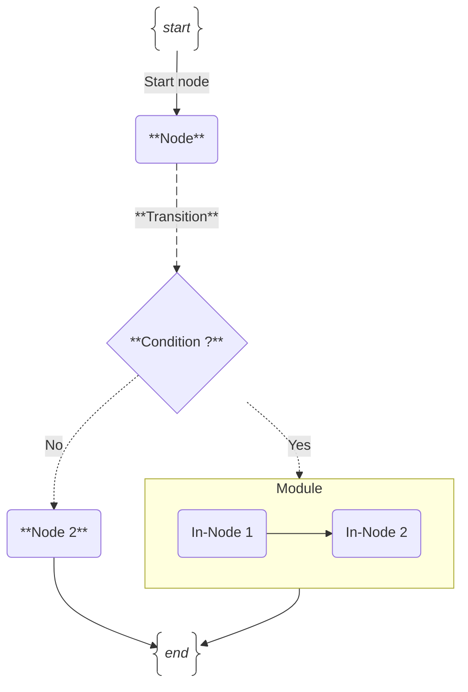

# jAI Workflow Overview

JavAI Workflow is a dynamic, flexible and stateful **AI agent framework** crafted as a Java library. It empowers java developers with granular control over the orchestrated workflows, iteratively, with cycles, flexibility, control, and conditional decisions. You would be able to build sophisticated AI applications. jAI Workflow is **model-agnostic**, **deployment-agnostic**, and is built for compatibility with **other java frameworks**. It makes easier to development, monitor, orchestrate and deploy AI agentic systems. 

## Principles:
- **Java-based** jAI workflows are configuration as code (java) and agnostic to AI models, enabling you can define custom advanced and dynamic workflows just writing Java code.
- **Stateful**: jAI Workflow is a stateful engine, enabling you to design custom states as POJO and transitions. This feature provides a robust foundation for managing the flow and state of your application.
- **Graph-Based**: The workflow is graph-based, offering the flexibility to define custom workflows with multiple directions such as one-way, round trip, loop, recursive and more. This feature allows for intricate control over the flow of your application.
- **Flexible**: jAI Workflow is designed with flexibility in mind. You can define custom workflows, modules or agents to build RAG systems as LEGO-like. A module can be decoupled and integrated in any other workflow.
- **AI Ecosystem integration**: jAI workflow is designed to be potentially integrable with any emerging AI technology in the future for java.
- **Publish as API**: jAI Workflow can be published as an API as entrypoint once you have defined your custom workflow. This feature allows you to expose your workflow as a service.
- **Observability**: jAI Workflow provides observability features to monitor the execution of the workflow, trace inputs and outputs, and debug the flow of your application.
- **Scalable**: jAI Workflow can be deployed as any java project as standalone or distributed through containers in any cloud provider or kubernetes environment. Each module can run in a different JVM env or container for scalability in production environments.

## Anatomy

### Node
A `Node` represents a single unit of work within the workflow. It encapsulates a specific function or task that processes the stateful bean and updates it. Nodes can be synchronous or asynchronous (streaming).

### Module
A `Module` is a collection of nodes grouped together to perform a higher-level function. Modules can be reused across different workflows, providing modularity and reusability.

### Workflow
A `Workflow` is a directed graph of nodes, modules and edges that defines the sequence of operations to be performed. It manages the state transitions and execution flow, ensuring that each node processes the stateful bean in the correct order.

### Transition
A `Transition` is a directed edge between two nodes or two modules, representing the flow of control from one node to another. Transitions can be sequential, parallel or loop, allowing for dynamic routing based on the state of the workflow.

## Visualization

<i>Diagram: jAI Workflow components representation.</i>

## Acknowledgement
jAI Workflow is influenced by [LangFlow](https://github.com/langflow-ai/langflow) and [LangGraph](https://langchain-ai.github.io/langgraph/tutorials/introduction/). The draws use [Graphviz](https://graphviz.gitlab.io/Gallery/directed/) capabilities to render the workflow visualization by default. However, the visualization engine allows you to implement your own customization and render the workflow importing your libs. `jai-workflow-langChain4j` lib is built on top of LangChain4j and is designed to be compatible with it, but can be used without LanChain4j.
